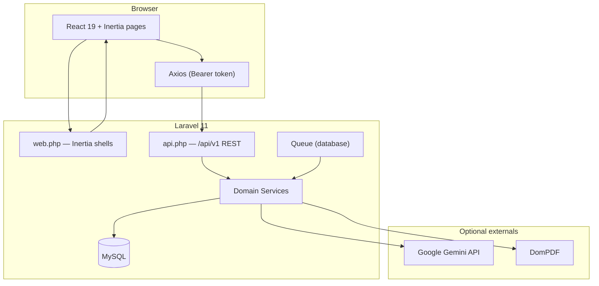
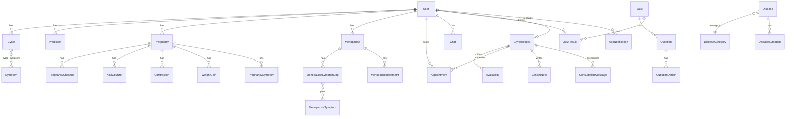

# FeminaSante — Architecture

Women's health web platform: menstrual cycle tracking, pregnancy, menopause, gynecologist appointments, health library, articles, quizzes, and a conversational assistant.

**Repository:** [github.com/oumaimasbai12/feminaSante](https://github.com/oumaimasbai12/feminaSante)

---

## Table of contents

1. [System overview](#1-system-overview)
2. [Tech stack](#2-tech-stack)
3. [Architectural pattern](#3-architectural-pattern)
4. [Repository layout](#4-repository-layout)
5. [Request & data flow](#5-request--data-flow)
6. [Authentication & authorization](#6-authentication--authorization)
7. [API surface](#7-api-surface)
8. [Frontend architecture](#8-frontend-architecture)
9. [Data model](#9-data-model)
10. [Domain modules](#10-domain-modules)
11. [Services layer](#11-services-layer)
12. [Events, queues & scheduler](#12-events-queues--scheduler)
13. [Notifications](#13-notifications)
14. [Configuration reference](#14-configuration-reference)
15. [Testing](#15-testing)
16. [Local development](#16-local-development)
17. [External integrations](#17-external-integrations)
18. [Conventions & legacy notes](#18-conventions--legacy-notes)
19. [Security model](#19-security-model)

---

## 1. System overview

FeminaSante serves three personas:

| Persona | Portal | Primary capabilities |
|---------|--------|----------------------|
| **Patient** | `/dashboard`, `/cycles`, `/menopause`, … | Health tracking, booking, content, AI chat |
| **Gynecologist** | `/gynecologist/*` | Appointments, availability, patient files, messaging |
| **Administrator** | `/admin/*` | Users, practitioners, articles, global appointments |

The application UI is **French** (`APP_LOCALE=fr`). Domain field names mix French and English legacy naming (`nom`, `motDePasse`, `appointements`).

### System context



---

## 2. Tech stack

| Layer | Technology | Version / notes |
|-------|------------|-----------------|
| Runtime | PHP | ^8.2 |
| Framework | Laravel | 11.x |
| API auth | Laravel Sanctum | Bearer tokens |
| SPA bridge | Inertia.js (Laravel + React) | Page shells only |
| UI | React | 19.x |
| Build | Vite | 6.x |
| CSS | Tailwind CSS | 3.x, design tokens in `resources/css/app.css` |
| HTTP client | Axios | Interceptors in `resources/js/bootstrap.js` |
| Icons | Lucide React | |
| Database | MySQL | Production; SQLite in-memory for tests |
| PDF | barryvdh/laravel-dompdf | Pregnancy medical summary export |
| AI (optional) | Google Gemini REST | Chat assistant + content seeder |
| Testing | PHPUnit | 11.x |
| Code style | Laravel Pint | |

---

## 3. Architectural pattern

### Hybrid SPA (Inertia shell + REST API)

FeminaSante uses a deliberate split:

1. **Laravel web routes** render **Inertia page shells** — React components with minimal server props.
2. **All business data** is loaded and mutated via **`/api/v1/*`** using Axios and a Sanctum Bearer token stored in `localStorage`.
3. **Web routes are not protected** by Laravel session auth (by design). Client-side guards (`requireAuth`, `requireAdmin`, `requireGynecologist`) redirect unauthenticated users; **API middleware enforces real authorization**.

This pattern allows:

- Public marketing/legal pages without session cookies
- Same React codebase for patient, admin, and gynecologist portals
- Token-based API usable from the SPA and testable with `sanctum` actingAs

### Layering (backend)

```
HTTP Request
    → Controller (validation, HTTP response)
        → Service (business rules, orchestration)
            → Eloquent Model (persistence)
```

Controllers stay thin; complex logic lives in `app/Services/`. There are **no Laravel Policy classes** — ownership and role checks happen in middleware and services/controllers.

---

## 4. Repository layout

```
feminaSante/
├── app/
│   ├── Console/Commands/       # Scheduled artisan commands
│   ├── Enums/                    # PHP 8.1 backed enums by domain
│   ├── Events/                   # Domain events (e.g. AppointmentRequested)
│   ├── Http/
│   │   ├── Controllers/
│   │   │   ├── Api/              # REST API (primary backend)
│   │   │   └── Gynecologist/     # One Inertia web controller
│   │   └── Middleware/           # Inertia, admin, gynecologist, audit log
│   ├── Listeners/                # Queued notification listeners
│   ├── Models/                   # Eloquent models (namespaced by domain)
│   ├── Providers/                # AppServiceProvider (Sanctum, events)
│   └── Services/                 # Domain business logic
├── bootstrap/app.php             # Routing, middleware aliases, scheduler
├── config/                       # App + domain config (appointments, menopause, pregnancy)
├── database/
│   ├── factories/
│   ├── migrations/               # ~50 migrations
│   └── seeders/
├── public/                       # Web root
├── resources/
│   ├── css/app.css               # Tailwind + design system
│   ├── js/
│   │   ├── Pages/                # Inertia pages (route → Page component)
│   │   ├── Components/           # Reusable UI + domain components
│   │   ├── Layouts/              # Role layouts
│   │   ├── hooks/                # useApiQuery, useDeferredLoading
│   │   ├── utils/                # auth, notifications, menopause, url
│   │   └── config/navigation.js  # Sidebar nav per role
│   └── views/app.blade.php       # Inertia root + @vite + @routes (Ziggy)
├── routes/
│   ├── web.php                   # Inertia page routes
│   ├── api.php                   # /api/v1 REST API
│   └── console.php
├── tests/
│   ├── Feature/                  # HTTP/integration tests
│   └── Unit/                     # Service unit tests
├── ARCHITECTURE.md               # This file
├── README.md
└── TEST_CREDENTIALS.md           # Seeded demo accounts
```

---

## 5. Request & data flow

### Page load (patient example: `/menopause`)

```
1. GET /menopause
2. Laravel → Inertia::render('Menopause/Index')
3. Blade app.blade.php loads Vite bundle (app.jsx)
4. React mounts Menopause/Index
5. useEffect → axios GET /api/v1/menopauses (Bearer token)
6. axios GET /api/v1/menopauses/{id}/dashboard
7. UI renders from API JSON
```

### Mutation (example: book appointment)

```
1. React POST /api/v1/appointments { gynecologist_id, slot, … }
2. AppointmentController → AppointmentBookingService
3. DB insert (status: pending)
4. Event AppointmentRequested → SendBookingNotification (queued)
5. AppNotification rows created for patient + doctor
6. JSON response → React updates UI
```

### Axios auth wiring

`resources/js/bootstrap.js` attaches `Authorization: Bearer {token}` from `localStorage.auth_token` on every request via `window.setAuthToken`.

---

## 6. Authentication & authorization

### Sanctum token flow

| Step | Location | Behavior |
|------|----------|----------|
| Register / Login | `POST /api/v1/register`, `POST /api/v1/login` | Returns `token` + `user` |
| Storage | `localStorage` | Keys: `auth_token`, `user` |
| Profile refresh | `GET /api/v1/profile` | `refreshUser()` in `utils/auth.js` |
| Logout | `POST /api/v1/logout` | Clears token, redirects to `/login` |

Custom Sanctum token model: `App\Models\PersonalAccessToken` (registered in `AppServiceProvider`).

Password field on `users` table is **`motDePasse`**. API accepts aliases `password` / `motDePasse` for compatibility.

### Roles

Roles are **boolean flags** on `users`, not a separate RBAC table:

| Role | DB flags | API middleware | Client guard |
|------|----------|----------------|--------------|
| Patient | default | `auth:sanctum` | `requireAuth()` |
| Admin | `is_admin = true` | `auth:sanctum` + `admin` | `requireAdmin()` |
| Gynecologist | `is_gynecologist = true` + linked `gynecologists.user_id` | `auth:sanctum` + `gynecologist` | `requireGynecologist()` |

Registration creates **patients only**. Gynecologist accounts are seeded (`GynecologistUserSeeder`) or created via `POST /api/v1/admin/gynecologists`.

### Middleware

| Alias | Class | Check |
|-------|-------|-------|
| `admin` | `AdminMiddleware` | `$user->is_admin` |
| `gynecologist` | `GynecologistMiddleware` | `$user->is_gynecologist` + profile exists |
| `log.sensitive` | `LogSensitiveData` | Audit log on profile/password updates |

### Resource ownership

Patient resources (cycles, pregnancies, menopause logs, appointments) verify `user_id === auth()->id()` in controllers. Gynecologist endpoints use `GynecologistPatientService::assertCanAccessPatient()` (requires at least one shared appointment).

---

## 7. API surface

Base URL: **`/api/v1`**

### Public (no token)

| Method | Path | Purpose |
|--------|------|---------|
| POST | `/register`, `/login` | Auth |
| POST | `/forgot-password`, `/reset-password` | Password reset |
| GET | `/articles`, `/articles/{id}` | Article read |
| GET | `/quizzes`, `/quizzes/{id}`, `/quizzes/{id}/play` | Quiz read/play |
| GET | `/gynecologists`, `/gynecologists/{id}` | Doctor directory |
| GET | `/gynecologists/{id}/availability`, `/slots` | Booking data |
| GET | `/availabilities` | Availability list |

### Patient (auth:sanctum)

| Domain | Key endpoints |
|--------|-----------------|
| Dashboard | `GET /dashboard` |
| Profile | `GET|PUT /profile`, `PUT /profile/password` |
| Cycles | `apiResource /cycles`, `/symptoms`, `/predictions` |
| Appointments | `apiResource /appointments`, `/preparation`, `/visit-summaries` |
| Messaging | `GET|POST /gynecologists/{id}/messages` (requires confirmed RDV) |
| Pregnancy | `apiResource /pregnancies` + nested checkups, kicks, contractions, weight, symptoms, `/dashboard`, `/export` |
| Menopause | `apiResource /menopauses` + `/dashboard`, symptom logs, treatments, symptom catalog |
| Chat | `GET|POST /chats` |
| Quizzes | `POST /quizzes/{id}/submit`, question check |
| Articles | `POST` create, comments, likes |
| Diseases | `/diseases/catalog`, `/symptom-checker`, `/prevention-tips` |
| Notifications | `apiResource /notifications` |

### Admin (`/admin/*` + middleware)

`GET /admin/dashboard`, users CRUD, gynecologists CRUD, articles update/delete, appointments list.

### Gynecologist (`/gynecologist/*` + middleware)

| Endpoint group | Actions |
|----------------|---------|
| Dashboard | `GET /gynecologist/dashboard` |
| Patients | `GET /patients`, `GET /patients/{user}/file`, priority, messages |
| Appointments | confirm, refuse, complete, status, notes |
| Availability | index, store, destroy |
| Clinical notes | index, store |

Full route definitions: `routes/api.php`.

---

## 8. Frontend architecture

### Entry point

`resources/js/app.jsx` — `createInertiaApp` resolves `./Pages/${name}.jsx` dynamically.

### Pages (`resources/js/Pages/`)

| Area | Pages |
|------|-------|
| Auth | `Auth/Login`, `Register`, `ForgotPassword`, `ResetPassword` |
| Patient | `Dashboard/Index`, `Cycles/Index`, `Cycle/*`, `Pregnancies/Index`, `Pregnancy/*`, `Menopause/Index`, `Appointments/Index`, `Gynecologists/*`, `Articles/*`, `Quizzes/Index`, `Chat/Index`, `Profile/Index`, `Diseases/*` |
| Admin | `Admin/Dashboard`, `Admin/Users/*`, `Admin/Gynecologists/*`, `Admin/Articles/*`, `Admin/Appointments/Index` |
| Gynecologist | `Gynecologist/Dashboard`, `Availability`, `Patients`, `PatientFile` |
| Legal | `Legal/Privacy`, `Terms`, `Contact` |
| Marketing | `Welcome` |

### Layouts & shell

- **`AppShell`** — unified sidebar + header for patient/admin/gynecologist (`Components/Layouts/AppShell.jsx`)
- **`AppLayout`** — patient wrapper
- **`AdminLayout`**, **`GynecologistLayout`** — role-specific nav from `config/navigation.js`

### Component organization

```
Components/
├── UI/              # GlassCard, StatTile, DataTable, Charts, FilterPills, StatusBadge
├── Common/          # Modal, Button, Alert
├── Layouts/         # AppShell, AuthenticatedLayout
├── Dashboard/       # QuickActions, journey widgets
├── Cycle/           # Cycle calendar, logging
├── Pregnancy/       # Dashboard, kick counter, weight tracker
├── Menopause/       # Dashboard, SymptomLogger, TreatmentManager, ProfileWizard
├── Appointments/    # BookingWizard, ConsultationMessages, DoctorAvailability
├── Assistant/       # Chat UI
├── Articles/        # Article cards, comments
├── Quizzes/         # Quiz player
├── Diseases/        # Symptom checker, disease detail
├── Profile/         # Data export, settings
└── Admin/           # ConfirmDialog, admin forms
```

### Hooks & utilities

| File | Role |
|------|------|
| `hooks/useApiQuery.js` | Cached GET requests with loading/error state |
| `hooks/useDeferredLoading.js` | Debounced skeleton display |
| `utils/auth.js` | Token, guards, logout, refreshUser |
| `utils/notifications.js` | Deep-link routing from notification types |
| `utils/menopause.js` | Age eligibility (≥45), stage labels |
| `utils/url.js` | Search params, scroll helpers |
| `utils/statusBadges.js` | Appointment/priority badge classes |

### Styling

Design tokens (brand colors, glass cards, buttons) live in `resources/css/app.css` with Tailwind `@layer` utilities: `.btn-primary`, `.btn-secondary`, `.input-field`, `.glass-card`.

Vite alias `@` → `resources/js` (`vite.config.js`).

---

## 9. Data model

### Core entities



### Notable schema details

| Item | Detail |
|------|--------|
| Appointments table | Named **`appointements`** (legacy spelling) |
| Appointment statuses | `pending`, `confirmed`, `cancelled`, `completed` |
| Menopause stages | `perimenopause`, `menopause`, `postmenopause` (12-month rule) |
| In-app notifications | Table backing `AppNotification` model (not Laravel's default notifications for mail) |
| User password column | `motDePasse` |

### Seeders (`DatabaseSeeder`)

Runs: `AdminUserSeeder`, `ArticleCategorySeeder`, `DiseaseCategorySeeder`, `StaticQuizSeeder`, `MenopauseSymptomSeeder`, `GynecologistSeeder`, `AvailabilitySeeder`, `GynecologistUserSeeder`, `WikipediaArticleSeeder`, `GeminiContentSeeder`.

---

## 10. Domain modules

### 10.1 Menstrual cycle

**Purpose:** Track periods, symptoms, flow, mood; predict next period.

| Layer | Files |
|-------|-------|
| API | `CycleController`, `SymptomController`, `PredictionController` |
| Service | `CycleService.php` — average length, current cycle day, predictions |
| Models | `Cycle`, `Symptom`, `Prediction` |
| UI | `Pages/Cycles/Index`, `Pages/Cycle/*`, `Components/Cycle/*` |

Predictions require sufficient history; dashboard handles single-cycle edge cases.

### 10.2 Pregnancy

**Purpose:** Week-by-week tracking, tools (kicks, contractions, weight), checkups, PDF export.

| Layer | Files |
|-------|-------|
| API | `PregnancyController`, `PregnancyDashboardController`, nested resource controllers |
| Service | `PregnancyService.php` — milestones, tips, DomPDF export |
| Config | `config/pregnancy.php` — weekly content, milestone definitions |
| UI | `Pages/Pregnancies/Index`, `Pages/Pregnancy/*`, `Components/Pregnancy/*` |
| Scheduler | `pregnancy:weekly-reminders` daily at 08:00 |

### 10.3 Menopause

**Purpose:** Profile wizard (stage classification), daily symptom journal, treatments, insights & charts.

| Layer | Files |
|-------|-------|
| API | `MenopauseController`, `MenopauseDashboardController`, `MenopauseSymptomLogController`, `MenopauseTreatmentController` |
| Service | `MenopauseService.php` — stage classification (12-month rule), insights, charts, correlations |
| Config | `config/menopause.php` — min age 45, symptom catalog, correlation rules, stage tips |
| UI | `Pages/Menopause/Index`, `Components/Menopause/*` |
| Eligibility | `User::menopause_eligible` + `utils/menopause.js` |

Symptom logs support a **catalog** (`menopause_symptoms` + pivot) synced to legacy boolean flags (`hot_flashes`, etc.) for charts and insights.

### 10.4 Appointments & teleconsultation

**Purpose:** Patient booking, doctor confirmation workflow, visit summaries, secure messaging.

| Layer | Files |
|-------|-------|
| Patient API | `AppointmentController`, `PatientConsultationMessageController`, `VisitSummaryController` |
| Gynecologist API | `Gynecologist/AppointmentController`, `ConsultationMessageController`, `ClinicalNoteController` |
| Services | `AppointmentBookingService`, `GynecologistAppointmentService`, `AppointmentReminderService` |
| Config | `config/appointments.php` — blocking statuses, patient message eligibility |
| Event | `AppointmentRequested` → `SendBookingNotification` |
| UI | `Pages/Appointments/Index`, `Gynecologists/Show`, `Gynecologist/Dashboard`, `PatientFile` |

**Messaging rule:** Patients may message a gynecologist only after at least one **`confirmed`** or **`completed`** appointment (`patient_message_statuses` in config).

**Video:** Jitsi links generated as `https://meet.jit.si/feminasante-{appointment_id}` when consultation type is video.

### 10.5 Health library (Diseases)

**Purpose:** Educational content, categories, symptom checker, prevention tips.

| Layer | Files |
|-------|-------|
| API | `Diseases/*` controllers under `/diseases` prefix |
| Service | `DiseaseInfoService.php` |
| Models | `Disease`, `DiseaseCategory`, related symptom/treatment/faq/resource/prevention models |
| UI | `Pages/Diseases/*`, `Components/Diseases/*` |

### 10.6 Articles & quizzes

**Articles:** Public read; authenticated users comment/like; admin update/delete.

**Quizzes:** Public play; authenticated submit results; static quizzes seeded via `StaticQuizSeeder`.

| Service | `QuizService.php` |
| Models | `Quiz`, `Question`, `QuestionOption`, `QuizResult` |

### 10.7 AI assistant

**Purpose:** Conversational health Q&A with disclaimer; not a substitute for medical advice.

| Layer | Files |
|-------|-------|
| API | `Assistant/ChatController` |
| Service | `AIService.php` |
| Model | `Assistant/Chat` — stores message, response, intent, sentiment, session_id |
| UI | `Pages/Chat/Index`, `Components/Assistant/*` |

Flow: Gemini REST API when `GEMINI_API_KEY` is set; otherwise keyword-based fallback responses in French.

### 10.8 Admin

Web shells under `/admin/*`; all mutations via `/api/v1/admin/*`. Manages users, gynecologists, articles, global appointment overview.

---

## 11. Services layer

| Service | Responsibility |
|---------|----------------|
| `CycleService` | Cycle statistics, predictions, current cycle day |
| `PregnancyService` | Pregnancy dashboard data, milestones, PDF export |
| `MenopauseService` | Stage classification, dashboard, insights, charts, symptom sync |
| `AppointmentBookingService` | Slot validation, conflict detection, booking creation |
| `GynecologistAppointmentService` | Status transitions (confirm/refuse/complete), notifications |
| `AppointmentReminderService` | 24h appointment reminders |
| `GynecologistPatientService` | Patient file aggregation, access control |
| `AIService` | Gemini integration + fallback |
| `QuizService` | Scoring, result persistence |
| `DiseaseInfoService` | Symptom checker logic, catalog queries |

Services are resolved via Laravel container (`app(Service::class)`) and injected into controllers.

---

## 12. Events, queues & scheduler

### Events

| Event | Listener | Effect |
|-------|----------|--------|
| `AppointmentRequested` | `SendBookingNotification` (queued) | Creates `AppNotification` for patient and doctor |

Registered in `AppServiceProvider`.

### Scheduled commands (`bootstrap/app.php`)

| Command | Schedule | Purpose |
|---------|----------|---------|
| `pregnancy:weekly-reminders` | Daily 08:00 | Pregnancy week notifications |
| `appointments:send-reminders` | Hourly | 24h-before RDV reminders |

### Queue

Default: `QUEUE_CONNECTION=database`. `composer dev` runs `queue:listen` alongside `artisan serve` and Vite.

---

## 13. Notifications

In-app notifications use the **`AppNotification`** model (table: `notifications`).

| Type examples | Trigger | Frontend routing |
|---------------|---------|------------------|
| `appointment_confirmed` | Doctor confirms RDV | `utils/notifications.js` → `/appointments` |
| `appointment_cancelled` | Doctor refuses | Re-booking link |
| `consultation_message` | Patient/doctor message | `/gynecologists/{id}?tab=messages` |
| `appointment_reminder` | Scheduler | `/appointments` |
| `follow_up_suggested` | Visit completed | `/gynecologists/{id}?book=1` |
| `menopause` | Profile created | `/menopause` |

Email is configured (`MAIL_MAILER=log` by default) but most flows use in-app notifications only.

---

## 14. Configuration reference

| File | Purpose |
|------|---------|
| `config/app.php` | App name, locale (`fr`), timezone |
| `config/auth.php` | Web guard, user provider |
| `config/sanctum.php` | Token auth, stateful domains |
| `config/services.php` | **Gemini** API key and model |
| `config/appointments.php` | Blocking statuses, common reasons, slot duration, **patient_message_statuses** |
| `config/menopause.php` | Post-menopause months, min tracking age, symptom catalog, correlation rules, stage tips |
| `config/pregnancy.php` | Milestones, weekly tips, symptom definitions |
| `config/database.php` | MySQL connection |
| `config/queue.php` | Database queue driver |

### Key environment variables

```env
APP_NAME=FeminaSante
APP_LOCALE=fr
DB_CONNECTION=mysql
DB_DATABASE=feminasante
QUEUE_CONNECTION=database
SESSION_DRIVER=database
CACHE_STORE=database
GEMINI_API_KEY=          # Optional — enables AI chat
GEMINI_MODEL=gemini-2.0-flash
```

See `.env.example` for the full list.

---

## 15. Testing

### Setup

- **Runner:** PHPUnit 11 (`phpunit.xml`)
- **DB:** SQLite in-memory (`RefreshDatabase` in feature tests)
- **Queue:** `sync` in tests
- **Command:** `php artisan test`

### Coverage areas (`tests/Feature/`)

Auth, cycles, symptoms, predictions, dashboard, chat, quizzes, articles, diseases, pregnancy (multiple), menopause, appointments, gynecologist portal, admin middleware, notifications, doctor-patient messaging, sensitive logging.

### Factories

26 factories under `database/factories/` support model creation in tests.

### Code style

```bash
./vendor/bin/pint
```

---

## 16. Local development

### Quick start

```bash
composer install
cp .env.example .env
php artisan key:generate
# Configure MySQL in .env
php artisan migrate --seed
npm install
composer dev    # serve + queue + pail + vite (concurrently)
```

`composer dev` runs four processes:

1. `php artisan serve`
2. `php artisan queue:listen --tries=1`
3. `php artisan pail --timeout=0`
4. `npm run dev`

### Production assets

```bash
npm run build
```

### Health check

`GET /up` — Laravel health endpoint.

Demo credentials: `TEST_CREDENTIALS.md`.

---

## 17. External integrations

| Integration | Usage | Required |
|-------------|-------|----------|
| **Google Gemini** | AI chat (`AIService`), optional content seeding | No — fallback responses without key |
| **DomPDF** | Pregnancy medical summary PDF | Yes for export feature |
| **Jitsi Meet** | Video consultation links (external URL, no API key) | No |
| **Wikipedia** | Article seeding only (`WikipediaArticleSeeder`) | Dev/seed only |
| **MySQL** | Primary persistence | Yes |

No payment, SMS, OAuth social login, or push notification providers are integrated.

---

## 18. Conventions & legacy notes

| Topic | Convention |
|-------|------------|
| Language | UI and user-facing API messages in **French** |
| Password column | `motDePasse` on users |
| Appointments table | `appointements` (typo preserved) |
| Gynecologist address | Column `adress` (typo preserved) |
| Pregnancy status field | `statuts` on pregnancies |
| Enums | PHP backed enums in `app/Enums/{Domain}/` |
| API versioning | `/api/v1` prefix |
| Authorization | Middleware + service checks, **no Policies** |
| Web auth | Intentionally unauthenticated at Laravel level; token on API |

When adding features, prefer:

- Service methods over fat controllers
- Domain config files for content/rules (`config/menopause.php` pattern)
- Feature tests with Sanctum tokens
- Reusing UI primitives from `Components/UI/`

---

## 19. Security model

| Concern | Implementation |
|---------|----------------|
| API authentication | Sanctum Bearer tokens |
| Role separation | `admin` / `gynecologist` middleware on API |
| Resource ownership | Controller/service checks on `user_id` |
| Patient–doctor messaging | Requires confirmed/completed appointment |
| Sensitive updates | `log.sensitive` middleware on profile/password |
| CSRF | Not applicable to token API; web routes are GET-only Inertia renders |
| XSS | React default escaping; user content in chat/articles |
| Secrets | `.env` only; never commit credentials |

### Known architectural trade-offs

1. **Web routes are public** — rely on client guards for UX; sensitive operations must stay on authenticated API routes.
2. **Token in localStorage** — standard SPA pattern; consider httpOnly cookies for hardened deployments.
3. **No granular RBAC** — three fixed roles sufficient for current scope.

---

## Document history

| Date | Notes |
|------|-------|
| 2026-06 | Initial comprehensive architecture document |

For installation and feature overview, see [README.md](./README.md).
